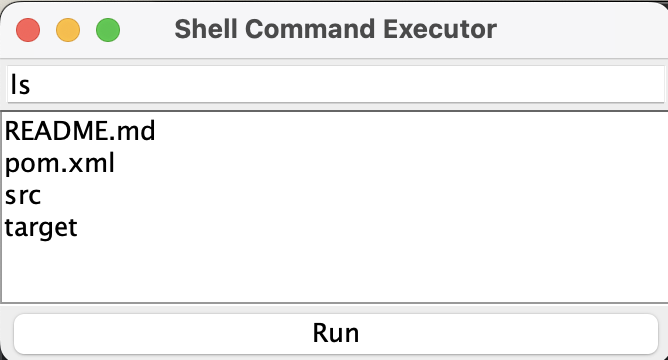

# 🖥️ Shell Command Executor

A minimal Java GUI app that executes shell commands and displays their output (stdout + stderr). Built using `Swing` and `ProcessBuilder`.

## ✨ Features

- Cross-platform shell command execution (Windows, Linux, macOS)
- Captures and displays both standard output and error output
- Simple and clean Swing-based GUI
- Auto-scrolls and appends output in real time

## 📦 Technologies Used

- Java 8+
- Swing (built-in GUI toolkit)
- ProcessBuilder
